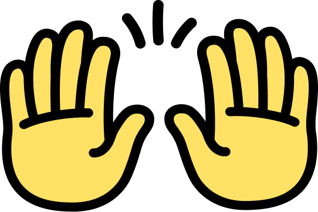
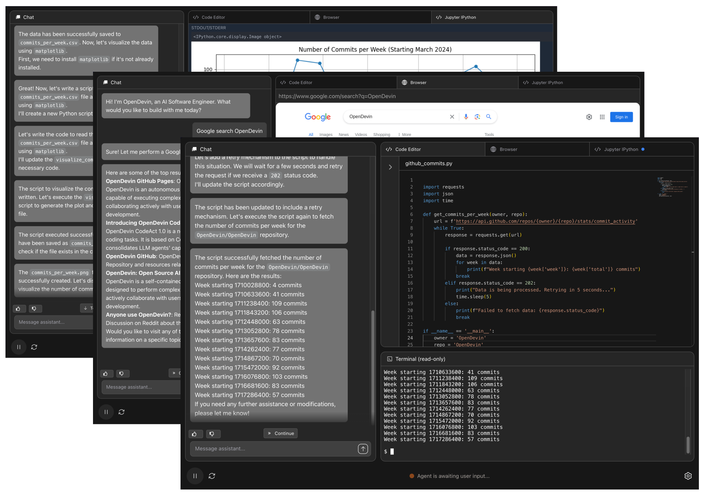

<<<<<<< HEAD
# Code-Wizard 使用手册

## 1. 引言
本手册旨在指导用户如何使用 Code-Wizard，一个基于 OpenHands 的工程级代码智能助手。它提供了一个全面的指南，帮助用户了解如何安装、配置和使用 Code-Wizard 的各项功能。

## 2. 系统要求
在开始之前，请确保您的系统满足以下要求：
- **操作系统**：Linux 、Mac 、 Windows wsl Ubuntu。
- **硬件**：足够的处理能力和内存。
- **网络连接**：稳定的网络连接，可顺畅地访问谷歌等网站。

## 3. 部署指南
### 基础环境配置
请参照 [OpenHands官方文档](https://github.com/All-Hands-AI/OpenHands) 完成基础的环境配置。

### 克隆代码
将代码从 GitHub 仓库克隆至你的本地环境中：

git clone https://github.com/MHFeng907/Code-Wizard-2024.git

### 构建项目
打开项目文件夹，在终端输入以下命令构建项目：

make build

终端显示信息如下则为构建成功。

### 启动应用
构建成功后，使用以下命令启动应用程序：


前端页面将显示在 3002 端口，终端显示信息如下则为启动成功。

### 启动页面
在浏览器中打开，即可访问启动页面。初次启动时需选择模型并配置 API Key。本项目在二次开发过程中使用 Gemini 模型，其 API Key 可免费申请并使用，用户可参考 [Gemini API](https://developers.google.com/ai/gemini) 进行注册。

### 启动确认
在启动页面的交互窗口输入内容后，进入正式工作页面，静等容器的构建与客户端的准备。当代理状态由等待变为初始化或等待用户输入的状态即代表程序成功运行。

## 4. 功能概览

### OpenHands 原系统功能
- 支持依托于开源的 LLM 与 Embedding 模型，实现基于开源模型的离线私有部署，可兼容 vllm 等高效推理框架。
- 支持统一的 API 调用，具备对各类开源大模型及模型 API 的接入扩充能力，具备不少于 32K 上下文支持。
- 支持登录 GitHub 账户并连接所持有的代码仓库进行初步整库分析与操作。
- 支持代码智能交互问答。

### Code-Wizard 新增/修复功能
- 修复 `make build` 与 `make run` 环节的问题。
- 修复历史对话内容持久化存储失败问题。
- 修复代码编辑区组件文件保存的系统不兼容问题。
- 集成工具库、代码库及知识库，连接 AnythingLLM API 进行管理。
- 支持代码补全、注释生成、代码翻译转换等功能。
- 支持项目级代码生成与优化。
- 支持有效的 prompt 模板预设与自定义。

## 5. 使用指南

### 5.1 代码内联补全
- **功能描述**：根据用户的输入实时提供代码补全建议。
- **使用步骤**：
  - 打开编辑器并输入代码。
  - 输入函数名后跟 # 时自动弹出补全建议。
  - 使用 `Tab` 键将补全代码插入文档。
  - 使用快捷键 `Ctrl+S`（或 `Cmd+S`）保存文件。
  
### 5.2 代码注释生成
- **功能描述**：根据选中的代码生成注释建议。
- **使用步骤**：
  - 在编辑器中选中代码。
  - 按快捷键 `Shift+Alt+P` 触发注释生成。
  - 编辑器会显示生成的注释，用户可以修改。
  
### 5.3 代码优化建议
- **功能描述**：根据选中的代码实时生成优化建议。
- **使用步骤**：
  - 选中代码片段。
  - 按快捷键 `Alt+Shift+L` 触发代码优化建议。
  - 根据优化建议修改代码。

### 5.4 VSCode工具集成调用
- **功能描述**：通过前端界面调用后端服务集成 VSCode 工具，直接从 Web 应用中打开 VSCode 项目。
- **使用步骤**：
  - 点击界面上的 “Open VS Code” 按钮，打开模态框。
  - 输入 VSCode 项目路径。
  - 点击 “Open VS Code” 按钮，触发后端 API 调用。

### 5.5 项目代码生成
- **功能描述**：通过输入项目路径、描述和语言生成代码。
- **使用步骤**：
  - 点击左侧栏的文件夹图标打开项目生成窗口。
  - 输入项目的存储路径、描述和语言。
  - 点击 “Generate Prompt” 生成与项目相关的代码生成 Prompt。

### 5.6 代码翻译转换
- **功能描述**：输入原始代码并选择源语言和目标语言，自动调用 Gemini API 进行代码翻译。
- **使用步骤**：
  - 点击翻译图标打开转换窗口。
  - 输入原代码并选择源语言和目标语言。
  - 点击翻译按钮生成翻译后的代码。

### 5.7 有效的 Prompt 模板预设与自定义管理
- **功能描述**：通过右键菜单快速选择或创建自定义的 Prompt 模板。
- **使用步骤**：
  - 右键点击聊天输入区域，选择预设模板或自定义模板。
  - 输入模板名称和内容，保存后可在菜单中使用。

### 5.8 知识库集成、管理与问答
- **功能描述**：通过前端界面配置并使用 AnythingLLM 的 API 进行知识库管理和问答。
- **使用步骤**：
  - 打开对话框模式设置界面，选择或创建工作区。
  - 输入 AnythingLLM 注册的 API 并保存设置。
  - 上传文件或链接进行代码整库的上传与向量化。

## 6. 常见问题

### 6.1 无法生成项目代码的解决方法
- **问题**：点击 “Generate Prompt” 按钮后未能生成代码。
- **解决方法**：
  - 确保输入了正确的项目路径、描述和语言。
  - 检查描述是否简明清晰，避免模糊或不完整的描述。

### 6.2 代码翻译不准确时的处理方法
- **问题**：翻译结果与预期不符。
- **解决方法**：
  - 检查原语言和目标语言选择是否正确。
  - 若翻译不准确，可手动修改或重新翻译。

### 6.3 翻译按钮未响应的解决方法
- **问题**：点击 “翻译” 按钮后界面无反应。
- **解决方法**：
  - 检查网络连接是否稳定。
  - 尝试刷新页面或重新启动浏览器。

## 7. 技术支持
感谢 OpenHands 开发团队的技术奠基，感谢软件体系结构与设计模式课程的教师和同学们的支持！如遇到技术问题，请在项目开源仓库中反馈，或者联系我们的技术支持团队获取帮助。

=======
<a name="readme-top"></a>

<div align="center">
  
  <h1 align="center">OpenHands: Code Less, Make More</h1>
</div>


<div align="center">
  <a href="https://github.com/All-Hands-AI/OpenHands/graphs/contributors"></a>
  <a href="https://github.com/All-Hands-AI/OpenHands/stargazers"></a>
  <a href="https://codecov.io/github/All-Hands-AI/OpenHands?branch=main"></a>
  <a href="https://github.com/All-Hands-AI/OpenHands/blob/main/LICENSE"></a>
  <br/>
  <a href="https://join.slack.com/t/opendevin/shared_invite/zt-2oikve2hu-UDxHeo8nsE69y6T7yFX_BA"></a>
  <a href="https://discord.gg/ESHStjSjD4"></a>
  <a href="https://github.com/All-Hands-AI/OpenHands/blob/main/CREDITS.md"></a>
  <br/>
  <a href="https://docs.all-hands.dev/modules/usage/getting-started"></a>
  <a href="https://arxiv.org/abs/2407.16741"></a>
  <a href="https://huggingface.co/spaces/OpenHands/evaluation"></a>
  <hr>
</div>

Welcome to OpenHands (formerly OpenDevin), a platform for software development agents powered by AI.

OpenHands agents can do anything a human developer can: modify code, run commands, browse the web,
call APIs, and yes—even copy code snippets from StackOverflow.

Learn more at [docs.all-hands.dev](https://docs.all-hands.dev), or jump to the [Quick Start](#-quick-start).



## ⚡ Quick Start

The easiest way to run OpenHands is in Docker. You can change `WORKSPACE_BASE` below to
point OpenHands to existing code that you'd like to modify.

See the [Installation](https://docs.all-hands.dev/modules/usage/installation) guide for
system requirements and more information.

```bash
export WORKSPACE_BASE=$(pwd)/workspace

docker pull ghcr.io/all-hands-ai/runtime:0.9-nikolaik

docker run -it --pull=always \
    -e SANDBOX_RUNTIME_CONTAINER_IMAGE=ghcr.io/all-hands-ai/runtime:0.9-nikolaik \
    -e SANDBOX_USER_ID=$(id -u) \
    -e WORKSPACE_MOUNT_PATH=$WORKSPACE_BASE \
    -v $WORKSPACE_BASE:/opt/workspace_base \
    -v /var/run/docker.sock:/var/run/docker.sock \
    -p 3100:3100 \
    --add-host host.docker.internal:host-gateway \
    --name openhands-app-$(date +%Y%m%d%H%M%S) \
    ghcr.io/all-hands-ai/openhands:0.9
```

You'll find OpenHands running at [http://localhost:3100](http://localhost:3100)!

You'll need a model provider and API key. One option that works well: [Claude 3.5 Sonnet](https://www.anthropic.com/api), but you have [many options](https://docs.all-hands.dev/modules/usage/llms).

---

You can also run OpenHands in a scriptable [headless mode](https://docs.all-hands.dev/modules/usage/how-to/headless-mode),
or as an [interactive CLI](https://docs.all-hands.dev/modules/usage/how-to/cli-mode).

Visit [Installation](https://docs.all-hands.dev/modules/usage/installation) for more information and setup instructions.

If you want to modify the OpenHands source code, check out [Development.md](https://github.com/All-Hands-AI/OpenHands/blob/main/Development.md).

Having issues? The [Troubleshooting Guide](https://docs.all-hands.dev/modules/usage/troubleshooting) can help.

## 📖 Documentation

To learn more about the project, and for tips on using OpenHands,
**check out our [documentation](https://docs.all-hands.dev/modules/usage/getting-started)**.

There you'll find resources on how to use different LLM providers,
troubleshooting resources, and advanced configuration options.

## 🤝 How to Contribute

OpenHands is a community-driven project, and we welcome contributions from everyone.
Whether you're a developer, a researcher, or simply enthusiastic about advancing the field of
software engineering with AI, there are many ways to get involved:

- **Code Contributions:** Help us develop new agents, core functionality, the frontend and other interfaces, or sandboxing solutions.
- **Research and Evaluation:** Contribute to our understanding of LLMs in software engineering, participate in evaluating the models, or suggest improvements.
- **Feedback and Testing:** Use the OpenHands toolset, report bugs, suggest features, or provide feedback on usability.

For details, please check [CONTRIBUTING.md](./CONTRIBUTING.md).

## 🤖 Join Our Community

Whether you're a developer, a researcher, or simply enthusiastic about OpenHands, we'd love to have you in our community.
Let's make software engineering better together!

- [Slack workspace](https://join.slack.com/t/opendevin/shared_invite/zt-2oikve2hu-UDxHeo8nsE69y6T7yFX_BA) - Here we talk about research, architecture, and future development.
- [Discord server](https://discord.gg/ESHStjSjD4) - This is a community-run server for general discussion, questions, and feedback.

## 📈 Progress

<p align="center">
  <a href="https://star-history.com/#All-Hands-AI/OpenHands&Date">
    
  </a>
</p>

## 📜 License

Distributed under the MIT License. See [`LICENSE`](./LICENSE) for more information.

## 🙏 Acknowledgements

OpenHands is built by a large number of contributors, and every contribution is greatly appreciated! We also build upon other open source projects, and we are deeply thankful for their work.

For a list of open source projects and licenses used in OpenHands, please see our [CREDITS.md](./CREDITS.md) file.

## 📚 Cite

```
@misc{opendevin,
      title={{OpenDevin: An Open Platform for AI Software Developers as Generalist Agents}},
      author={Xingyao Wang and Boxuan Li and Yufan Song and Frank F. Xu and Xiangru Tang and Mingchen Zhuge and Jiayi Pan and Yueqi Song and Bowen Li and Jaskirat Singh and Hoang H. Tran and Fuqiang Li and Ren Ma and Mingzhang Zheng and Bill Qian and Yanjun Shao and Niklas Muennighoff and Yizhe Zhang and Binyuan Hui and Junyang Lin and Robert Brennan and Hao Peng and Heng Ji and Graham Neubig},
      year={2024},
      eprint={2407.16741},
      archivePrefix={arXiv},
      primaryClass={cs.SE},
      url={https://arxiv.org/abs/2407.16741},
}
```
>>>>>>> e6bd57f6851359d2cef051a346365c11062814fe
